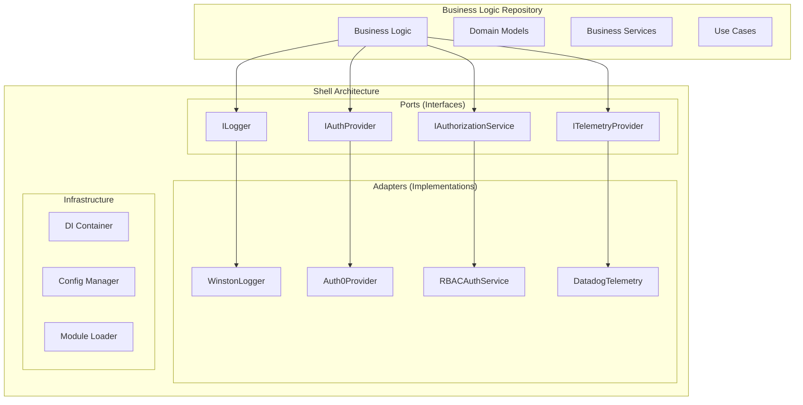
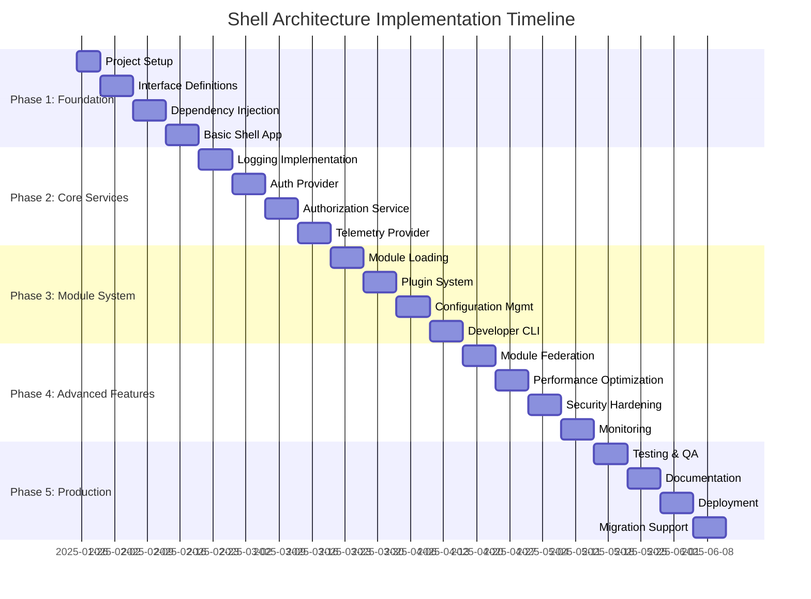

# Technical Specification Document
## Next.js TypeScript Shell Architecture

### Document Information
- **Version**: 1.0.0
- **Date**: 2025-01-25
- **Status**: Draft
- **Author**: Technical Architecture Team
- **Related PRD**: [PRD-shell-architecture.md](./PRD-shell-architecture.md)

---

## 1. Technical Architecture Overview

### 1.1 Architecture Pattern
The system follows a **Hexagonal Architecture** (Ports and Adapters) pattern combined with **Dependency Inversion Principle** to achieve complete separation of concerns between business logic and infrastructure implementations.



### 1.2 System Components

#### 1.2.1 Core Components
- **Interface Package**: TypeScript definitions for all contracts
- **Shell Application**: Next.js application providing infrastructure services
- **Business Module Loader**: Dynamic module loading and lifecycle management
- **Dependency Injection Container**: Service registration and resolution
- **Configuration Manager**: Environment and feature flag management
- **Plugin System**: Extensible middleware and interceptor framework

#### 1.2.2 Component Interaction Flow
```typescript
// Service Resolution Flow
Container → ServiceProvider → React Context → Component → Business Logic
```

---

## 2. API Specifications

### 2.1 Core Interface Definitions

#### 2.1.1 Logging Interface
```typescript
export interface ILogger {
  debug(message: string, meta?: LogMetadata): void;
  info(message: string, meta?: LogMetadata): void;
  warn(message: string, meta?: LogMetadata): void;
  error(message: string, error?: Error, meta?: LogMetadata): void;
  setContext(context: LogContext): void;
  createChild(context: Partial<LogContext>): ILogger;
  flush(): Promise<void>;
}

export interface LogMetadata {
  userId?: string;
  correlationId?: string;
  requestId?: string;
  [key: string]: any;
}

export interface LogContext {
  service: string;
  version: string;
  environment: string;
  [key: string]: any;
}
```

#### 2.1.2 Authentication Interface
```typescript
export interface IAuthProvider {
  login(credentials: LoginCredentials): Promise<AuthResult>;
  logout(): Promise<void>;
  refreshToken(refreshToken: string): Promise<TokenSet>;
  getCurrentUser(): Promise<User | null>;
  isAuthenticated(): Promise<boolean>;
  getAccessToken(): Promise<string | null>;
  onAuthStateChange(callback: AuthStateChangeCallback): () => void;
  validateToken(token: string): Promise<TokenValidationResult>;
}

export interface LoginCredentials {
  email?: string;
  username?: string;
  password?: string;
  provider?: string;
  redirectUri?: string;
}

export interface AuthResult {
  success: boolean;
  user?: User;
  tokens?: TokenSet;
  error?: AuthError;
}

export interface TokenSet {
  accessToken: string;
  refreshToken: string;
  idToken?: string;
  expiresIn: number;
  tokenType: string;
}

export interface User {
  id: string;
  email: string;
  name: string;
  roles: string[];
  permissions: string[];
  metadata: Record<string, any>;
}
```

#### 2.1.3 Authorization Interface
```typescript
export interface IAuthorizationService {
  hasPermission(permission: string | Permission): Promise<boolean>;
  hasRole(role: string | Role): Promise<boolean>;
  canAccess(resource: string, action: string, context?: AccessContext): Promise<boolean>;
  getUserPermissions(): Promise<Permission[]>;
  getUserRoles(): Promise<Role[]>;
  checkPolicy(policyName: string, context?: PolicyContext): Promise<boolean>;
  evaluateRule(rule: AuthorizationRule, context?: RuleContext): Promise<boolean>;
}

export interface Permission {
  id: string;
  name: string;
  resource: string;
  actions: string[];
  conditions?: PermissionCondition[];
}

export interface Role {
  id: string;
  name: string;
  permissions: Permission[];
  inheritedFrom?: Role[];
}

export interface AccessContext {
  userId: string;
  resource: string;
  action: string;
  environment: string;
  requestMetadata?: Record<string, any>;
}
```

#### 2.1.4 Telemetry Interface
```typescript
export interface ITelemetryProvider {
  trackEvent(name: string, properties?: EventProperties): void;
  trackMetric(name: string, value: number, unit?: string, tags?: Tags): void;
  trackError(error: Error, properties?: ErrorProperties): void;
  startSpan(name: string, options?: SpanOptions): ISpan;
  setUser(userId: string, properties?: UserProperties): void;
  setGlobalProperties(properties: GlobalProperties): void;
  flush(): Promise<void>;
  shutdown(): Promise<void>;
}

export interface ISpan {
  setTag(key: string, value: string | number | boolean): void;
  setStatus(status: SpanStatus): void;
  addEvent(name: string, properties?: Record<string, any>): void;
  end(): void;
}

export interface SpanOptions {
  parentSpan?: ISpan;
  tags?: Tags;
  startTime?: Date;
}

export type SpanStatus = 'ok' | 'cancelled' | 'unknown' | 'invalid_argument' | 'deadline_exceeded';
```

### 2.2 Business Module Interface

#### 2.2.1 Module Definition
```typescript
export interface IBusinessModule {
  readonly name: string;
  readonly version: string;
  readonly dependencies: ModuleDependency[];

  initialize(container: IServiceContainer): Promise<void>;
  getRoutes(): RouteDefinition[];
  getComponents(): ComponentDefinition[];
  getMiddleware(): MiddlewareDefinition[];
  getApiEndpoints(): ApiEndpointDefinition[];
  destroy(): Promise<void>;
}

export interface ModuleDependency {
  name: string;
  version: string;
  optional: boolean;
}

export interface RouteDefinition {
  path: string;
  method: HttpMethod;
  handler: RouteHandler;
  middleware: string[];
  permissions?: string[];
  metadata?: RouteMetadata;
}

export interface ComponentDefinition {
  name: string;
  component: React.ComponentType<any>;
  props?: ComponentProps;
  permissions?: string[];
  routes?: string[];
}
```

### 2.3 Service Container Interface

#### 2.3.1 Dependency Injection
```typescript
export interface IServiceContainer {
  register<T>(
    token: ServiceToken<T>,
    implementation: ServiceImplementation<T>,
    lifecycle?: ServiceLifecycle
  ): void;

  registerSingleton<T>(
    token: ServiceToken<T>,
    implementation: ServiceImplementation<T>
  ): void;

  registerFactory<T>(
    token: ServiceToken<T>,
    factory: ServiceFactory<T>
  ): void;

  resolve<T>(token: ServiceToken<T>): T;
  resolveAsync<T>(token: ServiceToken<T>): Promise<T>;

  createScope(): IServiceScope;
  dispose(): Promise<void>;
}

export interface IServiceScope extends Disposable {
  resolve<T>(token: ServiceToken<T>): T;
  resolveAsync<T>(token: ServiceToken<T>): Promise<T>;
}

export type ServiceToken<T = any> = symbol | string | Constructor<T>;
export type ServiceLifecycle = 'singleton' | 'transient' | 'scoped';
```

---

## 3. Data Models

### 3.1 Configuration Models

#### 3.1.1 Shell Configuration
```typescript
export interface ShellConfiguration {
  app: AppConfiguration;
  logging: LoggingConfiguration;
  auth: AuthConfiguration;
  telemetry: TelemetryConfiguration;
  modules: ModuleConfiguration;
  plugins: PluginConfiguration;
}

export interface AppConfiguration {
  name: string;
  version: string;
  environment: 'development' | 'staging' | 'production';
  baseUrl: string;
  port: number;
  cors: CorsConfiguration;
}

export interface LoggingConfiguration {
  level: LogLevel;
  provider: 'winston' | 'pino' | 'console';
  destinations: LogDestination[];
  format: LogFormat;
  redactionRules: RedactionRule[];
}

export interface AuthConfiguration {
  provider: 'auth0' | 'okta' | 'cognito' | 'custom';
  clientId: string;
  domain: string;
  audience?: string;
  scope: string[];
  redirectUri: string;
  postLogoutRedirectUri: string;
  tokenStorage: 'localStorage' | 'sessionStorage' | 'cookie';
}
```

### 3.2 Runtime Models

#### 3.2.1 Module Registry
```typescript
export interface ModuleRegistry {
  modules: Map<string, LoadedModule>;
  dependencies: DependencyGraph;
  loadOrder: string[];
}

export interface LoadedModule {
  module: IBusinessModule;
  status: ModuleStatus;
  loadTime: Date;
  error?: ModuleError;
  metadata: ModuleMetadata;
}

export type ModuleStatus = 'loading' | 'loaded' | 'error' | 'unloading' | 'unloaded';

export interface ModuleMetadata {
  path: string;
  hash: string;
  size: number;
  exports: string[];
}
```

### 3.3 Event Models

#### 3.3.1 System Events
```typescript
export interface SystemEvent {
  id: string;
  type: SystemEventType;
  timestamp: Date;
  source: string;
  data: EventData;
  correlationId?: string;
}

export type SystemEventType =
  | 'module.loaded'
  | 'module.unloaded'
  | 'module.error'
  | 'auth.login'
  | 'auth.logout'
  | 'auth.token.refreshed'
  | 'config.changed'
  | 'service.registered'
  | 'service.resolved';

export interface EventData {
  [key: string]: any;
}
```

---

## 4. Implementation Details

### 4.1 Project Structure

```
shell-typescript/
├── packages/
│   ├── interfaces/                     # @shell/interfaces
│   │   ├── src/
│   │   │   ├── auth/
│   │   │   │   ├── IAuthProvider.ts
│   │   │   │   ├── IAuthorizationService.ts
│   │   │   │   └── types.ts
│   │   │   ├── logging/
│   │   │   │   ├── ILogger.ts
│   │   │   │   └── types.ts
│   │   │   ├── telemetry/
│   │   │   │   ├── ITelemetryProvider.ts
│   │   │   │   └── types.ts
│   │   │   ├── core/
│   │   │   │   ├── IBusinessModule.ts
│   │   │   │   ├── IServiceContainer.ts
│   │   │   │   └── types.ts
│   │   │   └── index.ts
│   │   ├── package.json
│   │   └── tsconfig.json
│   │
│   ├── shell/                          # @shell/core
│   │   ├── src/
│   │   │   ├── app/
│   │   │   │   ├── layout.tsx
│   │   │   │   ├── page.tsx
│   │   │   │   └── globals.css
│   │   │   ├── components/
│   │   │   │   ├── providers/
│   │   │   │   │   ├── ServiceProvider.tsx
│   │   │   │   │   ├── AuthProvider.tsx
│   │   │   │   │   └── ModuleProvider.tsx
│   │   │   │   └── ui/
│   │   │   │       ├── LoadingSpinner.tsx
│   │   │   │       └── ErrorBoundary.tsx
│   │   │   ├── implementations/
│   │   │   │   ├── auth/
│   │   │   │   │   ├── Auth0Provider.ts
│   │   │   │   │   ├── CognitoProvider.ts
│   │   │   │   │   └── MockAuthProvider.ts
│   │   │   │   ├── logging/
│   │   │   │   │   ├── WinstonLogger.ts
│   │   │   │   │   ├── PinoLogger.ts
│   │   │   │   │   └── ConsoleLogger.ts
│   │   │   │   ├── telemetry/
│   │   │   │   │   ├── DatadogProvider.ts
│   │   │   │   │   ├── ApplicationInsightsProvider.ts
│   │   │   │   │   └── NoOpTelemetryProvider.ts
│   │   │   │   └── authorization/
│   │   │   │       ├── RBACAuthorizationService.ts
│   │   │   │       ├── ABACAuthorizationService.ts
│   │   │   │       └── PolicyBasedAuthorizationService.ts
│   │   │   ├── core/
│   │   │   │   ├── container/
│   │   │   │   │   ├── ServiceContainer.ts
│   │   │   │   │   ├── ServiceRegistry.ts
│   │   │   │   │   └── ServiceScope.ts
│   │   │   │   ├── modules/
│   │   │   │   │   ├── ModuleLoader.ts
│   │   │   │   │   ├── ModuleRegistry.ts
│   │   │   │   │   └── ModuleLifecycleManager.ts
│   │   │   │   ├── config/
│   │   │   │   │   ├── ConfigurationManager.ts
│   │   │   │   │   ├── EnvironmentVariableProvider.ts
│   │   │   │   │   └── FeatureFlagProvider.ts
│   │   │   │   └── plugins/
│   │   │   │       ├── PluginManager.ts
│   │   │   │       ├── MiddlewareRegistry.ts
│   │   │   │       └── InterceptorChain.ts
│   │   │   ├── hooks/
│   │   │   │   ├── useService.ts
│   │   │   │   ├── useAuth.ts
│   │   │   │   ├── useLogger.ts
│   │   │   │   └── useTelemetry.ts
│   │   │   ├── middleware/
│   │   │   │   ├── authMiddleware.ts
│   │   │   │   ├── loggingMiddleware.ts
│   │   │   │   └── telemetryMiddleware.ts
│   │   │   └── utils/
│   │   │       ├── constants.ts
│   │   │       ├── errors.ts
│   │   │       └── helpers.ts
│   │   ├── public/
│   │   ├── package.json
│   │   ├── next.config.js
│   │   └── tsconfig.json
│   │
│   └── cli/                            # @shell/cli
│       ├── src/
│       │   ├── commands/
│       │   │   ├── create.ts
│       │   │   ├── dev.ts
│       │   │   ├── build.ts
│       │   │   └── deploy.ts
│       │   ├── templates/
│       │   │   ├── basic-module/
│       │   │   ├── api-module/
│       │   │   └── ui-module/
│       │   ├── utils/
│       │   │   ├── fileSystem.ts
│       │   │   ├── packageManager.ts
│       │   │   └── validation.ts
│       │   └── index.ts
│       ├── templates/
│       ├── package.json
│       └── bin/
│           └── shell-cli.js
```

### 4.2 Service Container Implementation

#### 4.2.1 Container Setup
```typescript
// src/core/container/ServiceContainer.ts
import { Container, interfaces } from 'inversify';
import { TYPES } from '../constants';

export class ServiceContainer implements IServiceContainer {
  private container: Container;
  private scopes: Set<IServiceScope> = new Set();

  constructor() {
    this.container = new Container({
      defaultScope: 'Singleton',
      autoBindInjectable: true,
      skipBaseClassChecks: true
    });
    this.setupDefaultBindings();
  }

  private setupDefaultBindings(): void {
    // Logging
    this.container.bind<ILogger>(TYPES.Logger)
      .to(WinstonLogger)
      .inSingletonScope();

    // Authentication
    this.container.bind<IAuthProvider>(TYPES.AuthProvider)
      .toDynamicValue((context) => {
        const config = context.container.get<AuthConfiguration>(TYPES.AuthConfig);
        return AuthProviderFactory.create(config);
      })
      .inSingletonScope();

    // Authorization
    this.container.bind<IAuthorizationService>(TYPES.AuthorizationService)
      .to(RBACAuthorizationService)
      .inSingletonScope();

    // Telemetry
    this.container.bind<ITelemetryProvider>(TYPES.TelemetryProvider)
      .to(DatadogTelemetryProvider)
      .inSingletonScope();
  }

  register<T>(
    token: ServiceToken<T>,
    implementation: ServiceImplementation<T>,
    lifecycle: ServiceLifecycle = 'singleton'
  ): void {
    const binding = this.container.bind<T>(token);

    if (typeof implementation === 'function') {
      binding.to(implementation as interfaces.Newable<T>);
    } else {
      binding.toConstantValue(implementation);
    }

    switch (lifecycle) {
      case 'singleton':
        binding.inSingletonScope();
        break;
      case 'transient':
        binding.inTransientScope();
        break;
      case 'scoped':
        binding.inRequestScope();
        break;
    }
  }

  resolve<T>(token: ServiceToken<T>): T {
    return this.container.get<T>(token);
  }

  async resolveAsync<T>(token: ServiceToken<T>): Promise<T> {
    return this.container.getAsync<T>(token);
  }

  createScope(): IServiceScope {
    const scopeContainer = this.container.createChild();
    const scope = new ServiceScope(scopeContainer);
    this.scopes.add(scope);
    return scope;
  }
}
```

#### 4.2.2 React Integration
```typescript
// src/components/providers/ServiceProvider.tsx
import React, { createContext, useContext, useEffect, useState } from 'react';
import { ServiceContainer } from '../../core/container/ServiceContainer';

const ServiceContext = createContext<ServiceContainer | null>(null);

export interface ServiceProviderProps {
  children: React.ReactNode;
  configuration?: ShellConfiguration;
}

export const ServiceProvider: React.FC<ServiceProviderProps> = ({
  children,
  configuration
}) => {
  const [container, setContainer] = useState<ServiceContainer | null>(null);
  const [isInitialized, setIsInitialized] = useState(false);

  useEffect(() => {
    const initializeContainer = async () => {
      const serviceContainer = new ServiceContainer();

      if (configuration) {
        serviceContainer.register(TYPES.Configuration, configuration);
      }

      // Initialize core services
      const logger = serviceContainer.resolve<ILogger>(TYPES.Logger);
      const telemetry = serviceContainer.resolve<ITelemetryProvider>(TYPES.TelemetryProvider);

      logger.info('Shell architecture initialized', {
        version: configuration?.app.version,
        environment: configuration?.app.environment
      });

      setContainer(serviceContainer);
      setIsInitialized(true);
    };

    initializeContainer().catch(console.error);

    return () => {
      container?.dispose();
    };
  }, [configuration]);

  if (!isInitialized || !container) {
    return <LoadingSpinner message="Initializing shell architecture..." />;
  }

  return (
    <ServiceContext.Provider value={container}>
      <ErrorBoundary>
        {children}
      </ErrorBoundary>
    </ServiceContext.Provider>
  );
};

export const useServiceContainer = (): ServiceContainer => {
  const container = useContext(ServiceContext);
  if (!container) {
    throw new Error('useServiceContainer must be used within ServiceProvider');
  }
  return container;
};
```

### 4.3 Module Loading System

#### 4.3.1 Dynamic Module Loader
```typescript
// src/core/modules/ModuleLoader.ts
export class ModuleLoader {
  private registry: ModuleRegistry;
  private container: IServiceContainer;
  private logger: ILogger;

  constructor(
    registry: ModuleRegistry,
    container: IServiceContainer,
    logger: ILogger
  ) {
    this.registry = registry;
    this.container = container;
    this.logger = logger;
  }

  async loadModule(modulePath: string): Promise<LoadedModule> {
    this.logger.info('Loading business module', { modulePath });

    try {
      // Dynamic import with webpack ignore for runtime loading
      const moduleExports = await import(/* webpackIgnore: true */ modulePath);
      const ModuleClass = moduleExports.default || moduleExports.BusinessModule;

      if (!ModuleClass || typeof ModuleClass !== 'function') {
        throw new ModuleLoadError(`Module at ${modulePath} does not export a valid module class`);
      }

      // Create module instance
      const moduleInstance = new ModuleClass() as IBusinessModule;

      // Validate module interface
      this.validateModule(moduleInstance);

      // Initialize module with dependency injection
      await moduleInstance.initialize(this.container);

      // Register module routes and components
      this.registerModuleComponents(moduleInstance);

      const loadedModule: LoadedModule = {
        module: moduleInstance,
        status: 'loaded',
        loadTime: new Date(),
        metadata: {
          path: modulePath,
          hash: await this.calculateModuleHash(modulePath),
          size: 0, // Will be populated by bundler
          exports: Object.keys(moduleExports)
        }
      };

      this.registry.modules.set(moduleInstance.name, loadedModule);

      this.logger.info('Module loaded successfully', {
        moduleName: moduleInstance.name,
        version: moduleInstance.version
      });

      return loadedModule;

    } catch (error) {
      this.logger.error('Failed to load module', error, { modulePath });
      throw new ModuleLoadError(`Failed to load module: ${error.message}`, error);
    }
  }

  private validateModule(module: any): asserts module is IBusinessModule {
    const requiredMethods = ['initialize', 'getRoutes', 'getComponents', 'destroy'];
    const requiredProperties = ['name', 'version'];

    for (const method of requiredMethods) {
      if (typeof module[method] !== 'function') {
        throw new ModuleValidationError(`Module missing required method: ${method}`);
      }
    }

    for (const property of requiredProperties) {
      if (!module[property]) {
        throw new ModuleValidationError(`Module missing required property: ${property}`);
      }
    }
  }
}
```

### 4.4 Configuration Management

#### 4.4.1 Environment-based Configuration
```typescript
// src/core/config/ConfigurationManager.ts
export class ConfigurationManager {
  private config: ShellConfiguration;
  private providers: ConfigProvider[] = [];
  private watchers: ConfigWatcher[] = [];

  constructor() {
    this.loadConfiguration();
    this.setupConfigWatchers();
  }

  private loadConfiguration(): void {
    const environment = process.env.NODE_ENV || 'development';

    const baseConfig: ShellConfiguration = {
      app: {
        name: process.env.SHELL_APP_NAME || 'Shell Application',
        version: process.env.SHELL_VERSION || '1.0.0',
        environment: environment as any,
        baseUrl: process.env.SHELL_BASE_URL || 'http://localhost:3000',
        port: parseInt(process.env.PORT || '3000'),
        cors: {
          origin: process.env.CORS_ORIGIN?.split(',') || ['http://localhost:3000'],
          credentials: process.env.CORS_CREDENTIALS === 'true'
        }
      },
      logging: {
        level: (process.env.LOG_LEVEL as LogLevel) || 'info',
        provider: (process.env.LOG_PROVIDER as any) || 'winston',
        destinations: this.parseLogDestinations(process.env.LOG_DESTINATIONS),
        format: (process.env.LOG_FORMAT as LogFormat) || 'json',
        redactionRules: this.parseRedactionRules(process.env.LOG_REDACTION_RULES)
      },
      auth: {
        provider: (process.env.AUTH_PROVIDER as any) || 'auth0',
        clientId: process.env.AUTH_CLIENT_ID || '',
        domain: process.env.AUTH_DOMAIN || '',
        audience: process.env.AUTH_AUDIENCE,
        scope: process.env.AUTH_SCOPE?.split(',') || ['openid', 'profile', 'email'],
        redirectUri: process.env.AUTH_REDIRECT_URI || `${this.config?.app.baseUrl}/callback`,
        postLogoutRedirectUri: process.env.AUTH_POST_LOGOUT_REDIRECT_URI || this.config?.app.baseUrl,
        tokenStorage: (process.env.AUTH_TOKEN_STORAGE as any) || 'localStorage'
      },
      telemetry: {
        provider: (process.env.TELEMETRY_PROVIDER as any) || 'datadog',
        apiKey: process.env.TELEMETRY_API_KEY || '',
        endpoint: process.env.TELEMETRY_ENDPOINT,
        sampleRate: parseFloat(process.env.TELEMETRY_SAMPLE_RATE || '1.0'),
        environment: environment
      },
      modules: {
        autoLoad: process.env.MODULES_AUTO_LOAD === 'true',
        loadPath: process.env.MODULES_LOAD_PATH || './modules',
        allowedOrigins: process.env.MODULES_ALLOWED_ORIGINS?.split(',') || []
      },
      plugins: {
        directory: process.env.PLUGINS_DIRECTORY || './plugins',
        autoDiscovery: process.env.PLUGINS_AUTO_DISCOVERY === 'true'
      }
    };

    this.config = this.mergeWithOverrides(baseConfig);
  }
}
```

---

## 5. Testing Strategy

### 5.1 Testing Pyramid

#### 5.1.1 Unit Tests (70%)
- **Interface Contracts**: Test all interface implementations
- **Service Container**: Verify dependency resolution
- **Module Loader**: Test dynamic loading scenarios
- **Configuration**: Validate environment parsing
- **Error Handling**: Test all error scenarios

```typescript
// Example: Auth Provider Unit Test
describe('Auth0Provider', () => {
  let authProvider: Auth0Provider;
  let mockAuth0Client: jest.Mocked<Auth0Client>;

  beforeEach(() => {
    mockAuth0Client = createMockAuth0Client();
    authProvider = new Auth0Provider(mockAuth0Client, mockLogger, mockConfig);
  });

  describe('login', () => {
    it('should authenticate user with valid credentials', async () => {
      const credentials = { email: 'user@example.com', password: 'password' };
      const expectedUser = { id: '1', email: 'user@example.com', name: 'Test User' };

      mockAuth0Client.loginWithCredentials.mockResolvedValueOnce({
        user: expectedUser,
        tokens: mockTokenSet
      });

      const result = await authProvider.login(credentials);

      expect(result.success).toBe(true);
      expect(result.user).toEqual(expectedUser);
      expect(mockAuth0Client.loginWithCredentials).toHaveBeenCalledWith(credentials);
    });
  });
});
```

#### 5.1.2 Integration Tests (20%)
- **Service Integration**: Test service combinations
- **Module Loading**: Test actual module loading with filesystem
- **Configuration Loading**: Test environment configuration
- **Database Integration**: Test data persistence

```typescript
// Example: Module Loading Integration Test
describe('ModuleLoader Integration', () => {
  let moduleLoader: ModuleLoader;
  let testContainer: ServiceContainer;

  beforeEach(async () => {
    testContainer = new ServiceContainer();
    const registry = new ModuleRegistry();
    moduleLoader = new ModuleLoader(registry, testContainer, mockLogger);
  });

  it('should load and initialize a business module', async () => {
    const modulePath = './test-fixtures/sample-module.js';

    const loadedModule = await moduleLoader.loadModule(modulePath);

    expect(loadedModule.status).toBe('loaded');
    expect(loadedModule.module.name).toBe('sample-module');
    expect(loadedModule.module.getRoutes()).toHaveLength(3);
  });
});
```

#### 5.1.3 End-to-End Tests (10%)
- **Full Application Flow**: Test complete user journeys
- **Module Federation**: Test remote module loading
- **Authentication Flow**: Test complete auth workflows
- **Error Scenarios**: Test system-wide error handling

```typescript
// Example: E2E Authentication Test
describe('Authentication E2E', () => {
  it('should complete login flow and access protected resource', async () => {
    // Start shell application
    await startShellApp();

    // Navigate to login
    await page.goto('/login');

    // Fill credentials
    await page.fill('[data-testid="email"]', 'test@example.com');
    await page.fill('[data-testid="password"]', 'password123');
    await page.click('[data-testid="login-button"]');

    // Verify redirect to dashboard
    await expect(page).toHaveURL('/dashboard');

    // Verify access to protected resource
    const response = await page.request.get('/api/protected');
    expect(response.status()).toBe(200);
  });
});
```

### 5.2 Test Configuration

#### 5.2.1 Jest Configuration
```javascript
// jest.config.js
module.exports = {
  projects: [
    {
      displayName: 'interfaces',
      testMatch: ['<rootDir>/packages/interfaces/**/__tests__/**/*.test.ts'],
      transform: {
        '^.+\\.tsx?$': 'ts-jest'
      }
    },
    {
      displayName: 'shell',
      testMatch: ['<rootDir>/packages/shell/**/__tests__/**/*.test.ts'],
      setupFilesAfterEnv: ['<rootDir>/packages/shell/src/test/setup.ts'],
      testEnvironment: 'jsdom'
    },
    {
      displayName: 'e2e',
      testMatch: ['<rootDir>/tests/e2e/**/*.test.ts'],
      testEnvironment: '@playwright/test'
    }
  ],
  collectCoverageFrom: [
    'packages/**/*.ts',
    '!packages/**/*.d.ts',
    '!packages/**/node_modules/**'
  ],
  coverageThreshold: {
    global: {
      branches: 80,
      functions: 80,
      lines: 80,
      statements: 80
    }
  }
};
```

### 5.3 Mocking Strategy

#### 5.3.1 Service Mocks
```typescript
// src/test/mocks/serviceMocks.ts
export const createMockLogger = (): jest.Mocked<ILogger> => ({
  debug: jest.fn(),
  info: jest.fn(),
  warn: jest.fn(),
  error: jest.fn(),
  setContext: jest.fn(),
  createChild: jest.fn(),
  flush: jest.fn()
});

export const createMockAuthProvider = (): jest.Mocked<IAuthProvider> => ({
  login: jest.fn(),
  logout: jest.fn(),
  refreshToken: jest.fn(),
  getCurrentUser: jest.fn(),
  isAuthenticated: jest.fn(),
  getAccessToken: jest.fn(),
  onAuthStateChange: jest.fn(),
  validateToken: jest.fn()
});
```

---

## 6. Task Breakdown

### 6.1 Phase 1: Foundation (Weeks 1-4)

#### 6.1.1 Task 1: Project Setup and Monorepo Structure
- **1.1** Initialize monorepo with pnpm workspaces
- **1.2** Set up TypeScript configuration with project references
- **1.3** Configure ESLint and Prettier for consistent code style
- **1.4** Set up GitHub Actions for CI/CD pipeline
- **1.5** Create package structure for interfaces, shell, and CLI

#### 6.1.2 Task 2: Core Interface Definitions
- **2.1** Define ILogger interface with comprehensive logging methods
- **2.2** Define IAuthProvider interface with OAuth/OIDC support
- **2.3** Define IAuthorizationService interface with RBAC/ABAC
- **2.4** Define ITelemetryProvider interface with metrics and tracing
- **2.5** Define IBusinessModule interface for module contracts
- **2.6** Create comprehensive TypeScript type definitions

#### 6.1.3 Task 3: Dependency Injection System
- **3.1** Implement ServiceContainer using InversifyJS
- **3.2** Create service registration and resolution mechanisms
- **3.3** Implement scoped service lifetime management
- **3.4** Add React Context integration for component injection
- **3.5** Create service factory and decorator patterns

#### 6.1.4 Task 4: Basic Shell Application
- **4.1** Initialize Next.js application with TypeScript
- **4.2** Set up basic routing and layout structure
- **4.3** Implement ServiceProvider React component
- **4.4** Create error boundaries and loading states
- **4.5** Add basic configuration management

### 6.2 Phase 2: Core Service Implementations (Weeks 5-8)

#### 6.2.1 Task 5: Logging Implementation
- **5.1** Implement WinstonLogger with structured logging
- **5.2** Add support for multiple log destinations (file, console, remote)
- **5.3** Implement log redaction for sensitive information
- **5.4** Add correlation ID and request tracing
- **5.5** Create logger factory with configuration-based selection

#### 6.2.2 Task 6: Authentication Provider
- **6.1** Implement Auth0Provider with OAuth 2.0/OIDC
- **6.2** Add JWT token validation and refresh logic
- **6.3** Implement secure token storage strategies
- **6.4** Add authentication state management
- **6.5** Create mock authentication provider for development

#### 6.2.3 Task 7: Authorization Service
- **7.1** Implement RBAC authorization service
- **7.2** Add permission and role management
- **7.3** Implement policy-based authorization rules
- **7.4** Add resource-based access control
- **7.5** Create authorization middleware for routes

#### 6.2.4 Task 8: Telemetry Provider
- **8.1** Implement DatadogTelemetryProvider with metrics
- **8.2** Add distributed tracing with OpenTelemetry
- **8.3** Implement error tracking and reporting
- **8.4** Add custom event tracking
- **8.5** Create performance monitoring integration

### 6.3 Phase 3: Module System (Weeks 9-12)

#### 6.3.1 Task 9: Module Loading System
- **9.1** Implement dynamic module loader with ES6 imports
- **9.2** Add module validation and interface compliance checking
- **9.3** Implement module lifecycle management (load/unload)
- **9.4** Add module dependency resolution
- **9.5** Create module registry with metadata tracking

#### 6.3.2 Task 10: Plugin System
- **10.1** Define plugin interface and lifecycle hooks
- **10.2** Implement middleware registration system
- **10.3** Add interceptor chain for cross-cutting concerns
- **10.4** Create plugin discovery and auto-loading
- **10.5** Implement plugin configuration and settings

#### 6.3.3 Task 11: Configuration Management
- **11.1** Implement environment-based configuration loading
- **11.2** Add feature flag support with runtime toggles
- **11.3** Implement configuration validation and schemas
- **11.4** Add configuration hot-reloading capabilities
- **11.5** Create configuration encryption for secrets

#### 6.3.4 Task 12: Developer CLI Tool
- **12.1** Create CLI command structure with commander.js
- **12.2** Implement project scaffolding commands
- **12.3** Add module template generation
- **12.4** Create development server with hot reload
- **12.5** Add build and deployment commands

### 6.4 Phase 4: Advanced Features (Weeks 13-16)

#### 6.4.1 Task 13: Module Federation Setup
- **13.1** Configure Webpack Module Federation
- **13.2** Implement remote module loading
- **13.3** Add shared dependency management
- **13.4** Create micro-frontend routing
- **13.5** Implement federated component registration

#### 6.4.2 Task 14: Performance Optimization
- **14.1** Implement lazy loading for modules and components
- **14.2** Add code splitting optimization
- **14.3** Implement service worker for caching
- **14.4** Add bundle size analysis and optimization
- **14.5** Create performance monitoring dashboard

#### 6.4.3 Task 15: Security Hardening
- **15.1** Implement Content Security Policy (CSP)
- **15.2** Add input validation and sanitization
- **15.3** Implement rate limiting and DDoS protection
- **15.4** Add security headers and HTTPS enforcement
- **15.5** Create security audit and vulnerability scanning

#### 6.4.4 Task 16: Monitoring and Observability
- **16.1** Implement health check endpoints
- **16.2** Add application metrics dashboard
- **16.3** Create alerting and notification system
- **16.4** Implement log aggregation and search
- **16.5** Add performance profiling tools

### 6.5 Phase 5: Production Readiness (Weeks 17-20)

#### 6.5.1 Task 17: Testing and Quality Assurance
- **17.1** Achieve 80%+ test coverage across all packages
- **17.2** Implement comprehensive integration tests
- **17.3** Add end-to-end testing with Playwright
- **17.4** Create load testing scenarios
- **17.5** Implement automated testing pipeline

#### 6.5.2 Task 18: Documentation and Examples
- **18.1** Create comprehensive API documentation
- **18.2** Write developer getting started guide
- **18.3** Create example business modules
- **18.4** Add troubleshooting and FAQ documentation
- **18.5** Create video tutorials and demos

#### 6.5.3 Task 19: Deployment and Infrastructure
- **19.1** Create Docker containerization
- **19.2** Set up Kubernetes deployment manifests
- **19.3** Implement CI/CD pipeline with GitHub Actions
- **19.4** Add infrastructure as code (Terraform/CDK)
- **19.5** Create production deployment guides

#### 6.5.4 Task 20: Migration and Adoption
- **20.1** Create migration tools from existing systems
- **20.2** Write migration guides and best practices
- **20.3** Implement backward compatibility layers
- **20.4** Create adoption roadmap and timeline
- **20.5** Set up community support and contribution guidelines

---

## 7. Acceptance Criteria

### 7.1 Functional Acceptance Criteria

#### 7.1.1 Interface Package
- **AC-1.1**: All interfaces are exported from a single entry point
- **AC-1.2**: TypeScript compilation succeeds without errors
- **AC-1.3**: Package size is under 10KB when minified
- **AC-1.4**: All methods have comprehensive JSDoc documentation
- **AC-1.5**: Interfaces support async/await patterns where applicable

#### 7.1.2 Service Container
- **AC-2.1**: Services can be registered with singleton, transient, and scoped lifetimes
- **AC-2.2**: Circular dependencies are detected and reported
- **AC-2.3**: Service resolution time is under 10ms for typical scenarios
- **AC-2.4**: Container disposes resources properly on shutdown
- **AC-2.5**: React components can inject services via hooks

#### 7.1.3 Module Loading
- **AC-3.1**: Modules load dynamically without requiring application restart
- **AC-3.2**: Module loading time is under 500ms for typical modules
- **AC-3.3**: Failed module loads don't crash the shell application
- **AC-3.4**: Module dependencies are validated before loading
- **AC-3.5**: Modules can be unloaded and reloaded during development

#### 7.1.4 Authentication & Authorization
- **AC-4.1**: OAuth 2.0/OIDC authentication flow completes successfully
- **AC-4.2**: JWT tokens are validated and refreshed automatically
- **AC-4.3**: Role-based access control restricts unauthorized access
- **AC-4.4**: Authentication state persists across browser sessions
- **AC-4.5**: Logout clears all authentication tokens and state

#### 7.1.5 Logging & Telemetry
- **AC-5.1**: Structured logs are written to configured destinations
- **AC-5.2**: Log levels filter messages appropriately
- **AC-5.3**: Sensitive information is redacted from logs
- **AC-5.4**: Telemetry data is sent to monitoring systems
- **AC-5.5**: Distributed tracing correlates requests across services

### 7.2 Non-Functional Acceptance Criteria

#### 7.2.1 Performance
- **AC-6.1**: Initial page load time is under 3 seconds
- **AC-6.2**: Shell framework memory overhead is under 50MB
- **AC-6.3**: Bundle size for shell core is under 500KB
- **AC-6.4**: Service resolution latency is under 10ms
- **AC-6.5**: Module hot reload time is under 2 seconds

#### 7.2.2 Security
- **AC-7.1**: All HTTP requests use HTTPS in production
- **AC-7.2**: Authentication tokens are stored securely
- **AC-7.3**: CSP headers prevent XSS attacks
- **AC-7.4**: Input validation prevents injection attacks
- **AC-7.5**: Security vulnerabilities are scanned and addressed

#### 7.2.3 Reliability
- **AC-8.1**: System uptime is 99.9% or higher
- **AC-8.2**: Error boundaries prevent cascading failures
- **AC-8.3**: Circuit breakers protect against service failures
- **AC-8.4**: Health checks monitor system status
- **AC-8.5**: Graceful degradation handles service outages

#### 7.2.4 Maintainability
- **AC-9.1**: Code coverage is 80% or higher for all packages
- **AC-9.2**: API documentation covers all public interfaces
- **AC-9.3**: Semantic versioning is used for all packages
- **AC-9.4**: Breaking changes have migration guides
- **AC-9.5**: Code follows established style guidelines

#### 7.2.5 Developer Experience
- **AC-10.1**: New project setup takes under 30 minutes
- **AC-10.2**: TypeScript provides full IntelliSense support
- **AC-10.3**: Error messages are clear and actionable
- **AC-10.4**: Hot reload works for both shell and business logic
- **AC-10.5**: CLI tools generate working boilerplate code

### 7.3 Integration Acceptance Criteria

#### 7.3.1 Business Module Integration
- **AC-11.1**: Business modules can use all shell services via dependency injection
- **AC-11.2**: Module routes are automatically registered with Next.js router
- **AC-11.3**: Module components can be rendered within shell layout
- **AC-11.4**: Module middleware is applied to appropriate routes
- **AC-11.5**: Module unloading cleans up all registered resources

#### 7.3.2 External Service Integration
- **AC-12.1**: Auth0 integration supports multiple tenants
- **AC-12.2**: Datadog telemetry sends metrics and traces
- **AC-12.3**: Winston logger writes to multiple destinations
- **AC-12.4**: Configuration loads from environment variables
- **AC-12.5**: Feature flags toggle functionality at runtime

### 7.4 Deployment Acceptance Criteria

#### 7.4.1 Build and Packaging
- **AC-13.1**: All packages build successfully with zero errors
- **AC-13.2**: Build process completes in under 2 minutes
- **AC-13.3**: Generated bundles pass size budgets
- **AC-13.4**: TypeScript type checking passes for all packages
- **AC-13.5**: ESLint and Prettier checks pass for all code

#### 7.4.2 Runtime Environment
- **AC-14.1**: Application starts successfully in all supported environments
- **AC-14.2**: Environment variables are loaded and validated
- **AC-14.3**: Database connections (if required) are established
- **AC-14.4**: External service health checks pass
- **AC-14.5**: Application responds to health check endpoints

---

## 8. Risk Assessment and Mitigation

### 8.1 Technical Risks

| Risk ID | Risk Description | Impact | Probability | Mitigation Strategy |
|---------|------------------|---------|-------------|-------------------|
| TR-001 | Dynamic module loading performance bottlenecks | High | Medium | Implement lazy loading, code splitting, and caching strategies |
| TR-002 | Dependency injection container memory leaks | Medium | Low | Implement proper disposal patterns and scope management |
| TR-003 | TypeScript compilation issues with complex generics | Medium | Medium | Use conditional types carefully and provide fallbacks |
| TR-004 | Next.js compatibility issues with dynamic imports | High | Low | Test thoroughly with different Next.js versions |
| TR-005 | Service circular dependencies causing stack overflow | High | Low | Implement dependency graph validation and detection |

### 8.2 Security Risks

| Risk ID | Risk Description | Impact | Probability | Mitigation Strategy |
|---------|------------------|---------|-------------|-------------------|
| SR-001 | Malicious business modules loading arbitrary code | Critical | Medium | Implement module validation, sandboxing, and allowlisting |
| SR-002 | JWT token vulnerabilities in authentication | High | Low | Use secure token storage, validation, and rotation |
| SR-003 | XSS attacks through dynamic component loading | High | Medium | Implement CSP headers and input sanitization |
| SR-004 | Privilege escalation through authorization bypass | Critical | Low | Implement comprehensive permission validation |
| SR-005 | Sensitive data exposure in logs and telemetry | Medium | High | Implement data redaction and encryption |

### 8.3 Operational Risks

| Risk ID | Risk Description | Impact | Probability | Mitigation Strategy |
|---------|------------------|---------|-------------|-------------------|
| OR-001 | Service container initialization failures | High | Low | Implement fallback configurations and graceful degradation |
| OR-002 | External service dependencies unavailable | Medium | Medium | Implement circuit breakers and fallback mechanisms |
| OR-003 | Configuration management errors | Medium | Medium | Implement configuration validation and schema checking |
| OR-004 | Module loading from unreachable URLs | Medium | High | Implement retry logic and local fallbacks |
| OR-005 | Performance degradation under high load | High | Medium | Implement performance monitoring and auto-scaling |

### 8.4 Adoption Risks

| Risk ID | Risk Description | Impact | Probability | Mitigation Strategy |
|---------|------------------|---------|-------------|-------------------|
| AR-001 | Steep learning curve for developers | Medium | High | Provide comprehensive documentation and training |
| AR-002 | Resistance to architectural changes | High | Medium | Engage stakeholders early and provide migration support |
| AR-003 | Inadequate documentation and examples | Medium | Medium | Create extensive documentation and example applications |
| AR-004 | Complex debugging in distributed module system | Medium | High | Implement comprehensive logging and debugging tools |
| AR-005 | Version compatibility issues between shell and modules | High | Medium | Implement semantic versioning and compatibility checking |

---

## 9. Implementation Timeline

### 9.1 Detailed Schedule



### 9.2 Critical Path Analysis

**Critical Path**: Project Setup → Interface Definitions → Dependency Injection → Module Loading → Performance Optimization → Production Deployment

**Total Duration**: 20 weeks (140 days)

### 9.3 Resource Allocation

| Phase | Frontend Dev | Backend Dev | DevOps | QA | Tech Lead |
|-------|-------------|-------------|--------|-----|-----------|
| Phase 1 | 1.0 FTE | 1.0 FTE | 0.5 FTE | 0.2 FTE | 0.5 FTE |
| Phase 2 | 0.8 FTE | 1.2 FTE | 0.3 FTE | 0.5 FTE | 0.5 FTE |
| Phase 3 | 1.2 FTE | 1.0 FTE | 0.3 FTE | 0.5 FTE | 0.5 FTE |
| Phase 4 | 1.0 FTE | 0.8 FTE | 0.8 FTE | 0.7 FTE | 0.5 FTE |
| Phase 5 | 0.5 FTE | 0.5 FTE | 1.0 FTE | 1.0 FTE | 0.8 FTE |

---

## 10. Success Metrics and KPIs

### 10.1 Technical Metrics

| Metric | Target | Measurement Method |
|--------|--------|-------------------|
| Bundle Size | < 500KB (shell core) | Webpack Bundle Analyzer |
| Load Time | < 3 seconds (initial) | Lighthouse Performance |
| Memory Usage | < 50MB (framework overhead) | Browser DevTools |
| Test Coverage | > 80% (all packages) | Jest Coverage Reports |
| Build Time | < 2 minutes (full build) | CI/CD Pipeline Metrics |

### 10.2 Developer Experience Metrics

| Metric | Target | Measurement Method |
|--------|--------|-------------------|
| Setup Time | < 30 minutes | Onboarding Time Tracking |
| Hot Reload Time | < 2 seconds | Development Server Metrics |
| Documentation Coverage | 100% (public APIs) | API Documentation Audit |
| Developer Satisfaction | > 4.0/5.0 | Developer Surveys |
| Support Tickets | < 5 per week | Ticket Tracking System |

### 10.3 Operational Metrics

| Metric | Target | Measurement Method |
|--------|--------|-------------------|
| System Uptime | > 99.9% | Monitoring Dashboard |
| Error Rate | < 0.1% | Application Logs |
| Response Time | < 200ms (p95) | APM Tools |
| Security Vulnerabilities | 0 (high/critical) | Security Scanning |
| Module Load Success Rate | > 99% | Telemetry Data |

---

## 11. Appendices

### Appendix A: Technology Comparison Matrix

| Category | Option 1 | Option 2 | Option 3 | Recommendation |
|----------|----------|----------|----------|----------------|
| DI Framework | InversifyJS | TSyringe | Custom | InversifyJS |
| Module Federation | Webpack 5 | Vite | SystemJS | Webpack 5 |
| Logging | Winston | Pino | Bunyan | Winston |
| Auth Provider | Auth0 | Okta | AWS Cognito | Auth0 |
| Telemetry | Datadog | New Relic | Application Insights | Datadog |

### Appendix B: API Reference Examples

```typescript
// Complete usage example
import { useService, ILogger, IAuthProvider } from '@shell/interfaces';

export const BusinessComponent: React.FC = () => {
  const logger = useService<ILogger>('Logger');
  const auth = useService<IAuthProvider>('AuthProvider');

  const handleAction = async () => {
    logger.info('User action started');

    const isAuthenticated = await auth.isAuthenticated();
    if (!isAuthenticated) {
      logger.warn('Unauthenticated user attempted action');
      return;
    }

    // Business logic here
    logger.info('User action completed successfully');
  };

  return (
    <button onClick={handleAction}>
      Perform Action
    </button>
  );
};
```

### Appendix C: Migration Guide Template

```markdown
# Migration from Legacy System to Shell Architecture

## Pre-Migration Checklist
- [ ] Audit existing authentication implementation
- [ ] Inventory logging patterns and destinations
- [ ] Document current authorization rules
- [ ] Assess telemetry and monitoring setup

## Migration Steps
1. Install shell packages
2. Replace authentication logic
3. Update logging calls
4. Migrate authorization rules
5. Configure telemetry provider
6. Test and validate

## Post-Migration Validation
- [ ] All tests pass
- [ ] Authentication flows work
- [ ] Logs are properly formatted
- [ ] Authorization rules are enforced
- [ ] Telemetry data is collected
```

---

**Document Approval**

| Role | Name | Date | Signature |
|------|------|------|-----------|
| Technical Lead | | | |
| Senior Developer | | | |
| DevOps Engineer | | | |
| QA Lead | | | |
| Product Manager | | | |